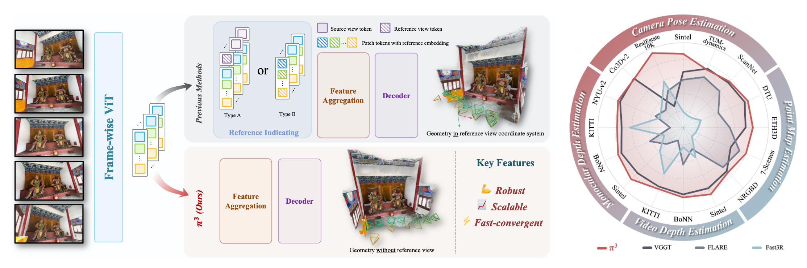

<h1 align="center">🌌 <em>&pi;³</em>: Scalable Permutation-Equivariant Visual Geometry Learning</h1>

<div align="center">
    <p>
        <a href="https://github.com/yyfz">Yifan Wang</a><sup>1*</sup>&nbsp;&nbsp;
        <a href="https://zhoutimemachine.github.io">Jianjun Zhou</a><sup>123*</sup>&nbsp;&nbsp;
        <a href="https://www.haoyizhu.site">Haoyi Zhu</a><sup>1</sup>&nbsp;&nbsp;
        <a href="https://github.com/AmberHeart">Wenzheng Chang</a><sup>1</sup>&nbsp;&nbsp;
        <a href="https://github.com/yangzhou24">Yang Zhou</a><sup>1</sup>
        <br>
        <a href="https://github.com/LiZizun">Zizun Li</a><sup>1</sup>&nbsp;&nbsp;
        <a href="https://github.com/SOTAMak1r">Junyi Chen</a><sup>1</sup>&nbsp;&nbsp;
        <a href="https://oceanpang.github.io">Jiangmiao Pang</a><sup>1</sup>&nbsp;&nbsp;
        <a href="https://cshen.github.io">Chunhua Shen</a><sup>2</sup>&nbsp;&nbsp;
        <a href="https://tonghe90.github.io">Tong He</a><sup>13†</sup>
    </p>
    <p>
        <sup>1</sup>Shanghai AI Lab &nbsp;&nbsp;&nbsp;
        <sup>2</sup>ZJU &nbsp;&nbsp;&nbsp;
        <sup>3</sup>SII
    </p>
    <p>
        <sup>*</sup> Equal Contribution &nbsp;&nbsp;&nbsp;
        <sup>†</sup> Corresponding Author
    </p>
</div>

<p align="center">
    <a href="https://arxiv.org/abs/2507.13347" target="_blank">
    
    </a>
    <a href="https://yyfz.github.io/pi3/" target="_blank">
    
    </a>
    <a href="https://huggingface.co/spaces/yyfz233/Pi3" target="_blank">
    
    </a>
</p>

<div align="center">
    <a href="[PROJECT_PAGE_LINK_HERE]">
        
    </a>
    <p>
        <i>&pi;³ reconstructs visual geometry without a fixed reference view, achieving robust, state-of-the-art performance.</i>
    </p>
</div>


## 📣 Updates
* **[July 29, 2025]** 📈 Evaluation code is released! See `evaluation` branch for details.
* **[July 16, 2025]** 🚀 Hugging Face Demo and inference code are released!


## ✨ Overview
We introduce $\pi^3$ (Pi-Cubed), a novel feed-forward neural network that revolutionizes visual geometry reconstruction by **eliminating the need for a fixed reference view**. Traditional methods, which rely on a designated reference frame, are often prone to instability and failure if the reference is suboptimal.

In contrast, $\pi^3$ employs a fully **permutation-equivariant** architecture. This allows it to directly predict affine-invariant camera poses and scale-invariant local point maps from an unordered set of images, breaking free from the constraints of a reference frame. This design makes our model inherently **robust to input ordering** and **highly scalable**.

A key emergent property of our simple, bias-free design is the learning of a dense and structured latent representation of the camera pose manifold. Without complex priors or training schemes, $\pi^3$ achieves **state-of-the-art performance** 🏆 on a wide range of tasks, including camera pose estimation, monocular/video depth estimation, and dense point map estimation.


## 🚀 Quick Start

### 1. Clone & Install Dependencies
First, clone the repository and install the required packages.
```bash
git clone https://github.com/yyfz/Pi3.git
cd Pi3
pip install -r requirements.txt
```

### 2\. Run Inference from Command Line

Try our example inference script. You can run it on a directory of images or a video file.

If the automatic download from Hugging Face is slow, you can download the model checkpoint manually from [here](https://huggingface.co/yyfz233/Pi3/resolve/main/model.safetensors) and specify its local path using the `--ckpt` argument.

```bash
# Run with default example video
python example.py

# Run on your own data (image folder or .mp4 file)
python example.py --data_path <path/to/your/images_dir_or_video.mp4>
```

**Optional Arguments:**

  * `--data_path`: Path to the input image directory or a video file. (Default: `examples/skating.mp4`)
  * `--save_path`: Path to save the output `.ply` point cloud. (Default: `examples/result.ply`)
  * `--interval`: Frame sampling interval. (Default: `1` for images, `10` for video)
  * `--ckpt`: Path to a custom model checkpoint file.
  * `--device`: Device to run inference on. (Default: `cuda`)

### 3\. Run with Gradio Demo

You can also launch a local Gradio demo for an interactive experience.

```bash
# Install demo-specific requirements
pip install -r requirements_demo.txt

# Launch the demo
python demo_gradio.py
```


## 🛠️ Detailed Usage

### Model Input & Output

The model takes a tensor of images and outputs a dictionary containing the reconstructed geometry.

  * **Input**: A `torch.Tensor` of shape $B \times N \times 3 \times H \times W$ with pixel values in the range `[0, 1]`.
  * **Output**: A `dict` with the following keys:
      * `points`: Global point cloud unprojected by `local points` and `camerae_poses` (`torch.Tensor`, $B \times N \times H \times W \times 3$).
      * `local_points`: Per-view local point maps (`torch.Tensor`,  $B \times N \times H \times W \times 3$).
      * `conf`: Confidence scores for local points (values in `[0, 1]`, higher is better) (`torch.Tensor`,  $B \times N \times H \times W \times 1$).
      * `camera_poses`: Camera-to-world transformation matrices (`4x4` in OpenCV format) (`torch.Tensor`,  $B \times N \times 4 \times 4$).

### Example Code Snippet

Here is a minimal example of how to run the model on a batch of images.

```python
import torch
from pi3.models.pi3 import Pi3
from pi3.utils.basic import load_images_as_tensor # Assuming you have a helper function

# --- Setup ---
device = 'cuda' if torch.cuda.is_available() else 'cpu'
model = Pi3.from_pretrained("yyfz233/Pi3").to(device).eval()
# or download checkpoints from `https://huggingface.co/yyfz233/Pi3/resolve/main/model.safetensors`

# --- Load Data ---
# Load a sequence of N images into a tensor
# imgs shape: (N, 3, H, W).
# imgs value: [0, 1]
imgs = load_images_as_tensor('path/to/your/data', interval=10).to(device)

# --- Inference ---
print("Running model inference...")
# Use mixed precision for better performance on compatible GPUs
dtype = torch.bfloat16 if torch.cuda.is_available() and torch.cuda.get_device_capability()[0] >= 8 else torch.float16

with torch.no_grad():
    with torch.amp.autocast('cuda', dtype=dtype):
        # Add a batch dimension -> (1, N, 3, H, W)
        results = model(imgs[None])

print("Reconstruction complete!")
# Access outputs: results['points'], results['camera_poses'] and results['local_points'].
```


## 🙏 Acknowledgements

Our work builds upon several fantastic open-source projects. We'd like to express our gratitude to the authors of:

  * [DUSt3R](https://github.com/naver/dust3r)
  * [CUT3R](https://github.com/CUT3R/CUT3R)
  * [VGGT](https://github.com/facebookresearch/vggt)


## 📜 Citation

If you find our work useful, please consider citing:

```bibtex
@misc{wang2025pi3,
      title={$\pi^3$: Scalable Permutation-Equivariant Visual Geometry Learning}, 
      author={Yifan Wang and Jianjun Zhou and Haoyi Zhu and Wenzheng Chang and Yang Zhou and Zizun Li and Junyi Chen and Jiangmiao Pang and Chunhua Shen and Tong He},
      year={2025},
      eprint={2507.13347},
      archivePrefix={arXiv},
      primaryClass={cs.CV},
      url={https://arxiv.org/abs/2507.13347}, 
}
```


## 📄 License
For academic use, this project is licensed under the 2-clause BSD License. See the [LICENSE](./LICENSE) file for details. For commercial use, please contact the authors.
